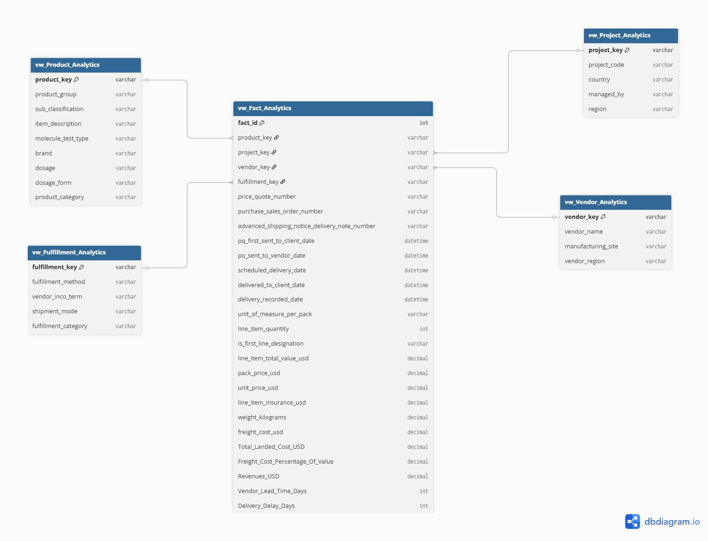

# 🚚 Supply Chain Logistics & Procurement Performance Analytics

> **End-to-End Data Engineering & Supply Chain Analytics Project using SQL Server (T-SQL) & Power BI**

---

## 📌 Project Overview

This project transforms complex, transactional global supply chain and procurement data into a high-performance analytical solution using SQL Server and Power BI. The pipeline covers data transformation and quality controls, Star Schema warehouse design, advanced financial/logistics metrics formulation (such as Total Landed Cost and Lead-Time Volatility), and interactive dashboard design for supply chain risk mitigation.

---

## 📷 Dashboard Preview

<p align="center">
  
</p>

---

## 🛠️ Tech Stack & Skills Demonstrated

- **Database Engine:** SQL Server (T-SQL)
- **Data Architecture:** Star Schema Modeling, Fact-to-Dimension Relationships, Dimensional Isolation
- **Advanced SQL:** Statistical Aggregations (`STDEV`), Conditional Logic (`CASE WHEN`), Data Type Safety (`TRY_CAST`), Handling Nulls (`ISNULL`, `NULLIF`), Date Analytics (`DATEDIFF`, `EOMONTH`)
- **Data Visualization:** Power BI
- **Supply Chain Domain Knowledge:** Incoterms Optimization, Lead Time Predictability, Total Landed Cost Architecture, Vendor Risk Assessment

---

## 📐 Data Warehouse Architecture (Star Schema)

To maximize query execution performance and align with Kimball data warehousing standards, the database was structured into an optimized Star Schema.

---

## 🧱 Schema Preview

<p align="center">
  
</p>

### 📊 Fact Tables

- `vw_Fact_Analytics` / `fact_table`  
  Central transactional fact table containing milestones (PO, PQ), quantities, values, and logistics metrics.

---

### 🧩 Dimension Tables

- `vw_Product_Analytics` (`dim_product`) — Product classification, brand, and category structure  
- `vw_Vendor_Analytics` (`dim_vendor`) — Vendor profiles and manufacturing locations  
- `vw_Project_Analytics` (`dim_project`) — Project metadata and country mapping  
- `vw_Fulfillment_Analytics` (`dim_fulfillment`) — Shipping modes and Incoterms

---

## 📈 Key Implementation Steps

### 1. Data Transformation & Metric Formulation

**Total Landed Cost Calculation**

\[
Total Landed Cost = Line Item Value + Freight Cost + Insurance
\]

Ensures full visibility into true procurement cost per item.

---

**Defensive Data Casting**

Used `TRY_CAST()` to safely convert dirty numeric fields and prevent runtime SQL failures.

---

**Logistics Efficiency Tracking**

Applied `NULLIF()` to avoid division-by-zero errors when calculating freight-to-value ratios.

---

### 2. Business Logic Enrichment (SQL Views)

- **Lead Time Tracking:** `DATEDIFF()` between PO creation and delivery date  
- **Delivery Delay Analysis:** Variance between promised vs actual delivery  
- **Geographic Segmentation:** CASE-based grouping into global regions (NA, EU, ASIA)

---

### 3. Business Intelligence Dashboard

- Freight cost vs product value monitoring  
- OTIF (On-Time In-Full) delivery performance tracking  
- Vendor lead time variability analysis  
- Country-level logistics cost distribution  
- Monthly landed cost trend analysis  

---

## 📊 Advanced SQL Analytics

- Star Schema joins & dimensional modeling  
- Standard deviation analysis (`STDEV`) for supply variability  
- Time-series trend analysis (`EOMONTH`)  
- Cost ratio optimization models  
- Performance filtering using `HAVING` clauses  

---

## 🎯 Business Value Delivered

- Reduce supply chain risk through vendor delay detection  
- Improve procurement decisions using cost-to-value analysis  
- Optimize logistics routes and Incoterms strategy  
- Identify high-risk suppliers using volatility metrics  
- Improve financial forecasting of landed costs  

---

## 📈 Executive Results

For detailed insights and KPI breakdown:

👉 **Logistics Executive Briefing → (Docs/Business_Insights.md)**

---

## 📁 Repository Structure

```
Supply-Chain-Logistics-Analytics/
│
├── README.md
├── business_insights.md
│
├── Screenshots/
│   ├── dashboard-overview.png
│   └── Schema.png
│
├── SQL Scripts/
│   └── 01_Create_View_Tables
│   └── 02_Analysis
│
```

---

## 👤 Author

**Bahaa Mandour**  
Data Analyst | Supply Chain BI Developer | SQL & Power BI Enthusiast
